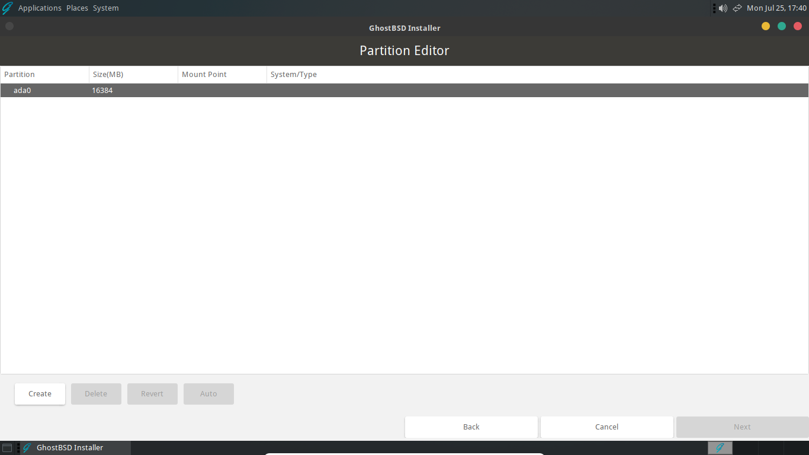
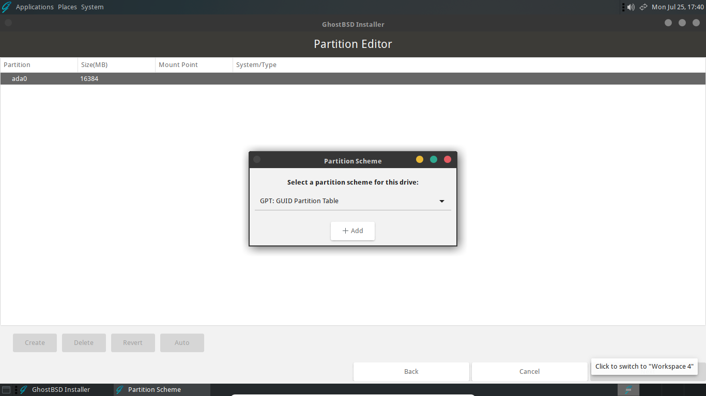
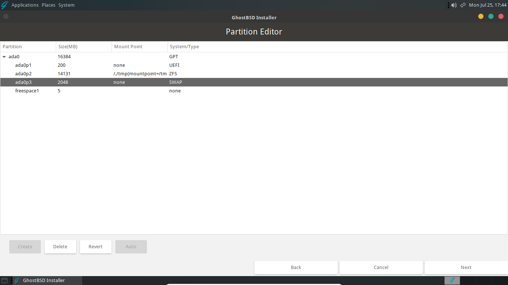

Custom Installation
===================

A custom installation and full disk installation of GhostBSD begin the same way. Please follow the [Full disk installation](full-disk-installation.md) guide until the *Disks and filesystem* section. When that section is reached, follow this guide to complete the custom installation.

The purpose of this guide is not to provide the steps for every possible configuration, but to provide a resource to get started with custom partitioning and filesystem layouts. Continue reading if you would like a more in-depth description of the installation process. Skip to [Installing GhostBSD](#installing-ghostbsd) if you just want the steps needed for a custom installation with the recommended setup using GPT and ZFS.

## Partitioning schemes

There are two partitioning schemes available in GhostBSD that are used to divide a disk into sections called slices or partitions. There is the older Master Boot Record (MBR) layout and the newer GUID Partition Table (GPT) layout. If you would like to learn about the other partitioning schemes not in GhostBSD, click [here](https://en.wikipedia.org/wiki/Disk_partitioning#Boot_partitions). It is recommended that GhostBSD be installed using GPT except where compatibility requirements dictate otherwise.

### MBR

There are several limitations when using the older MBR layout including limits on the size of the disk and number of partitions that are possible. MBR only officially supports disks that are up to two terabytes. There is also a limit of four primary partitions but an extended partition may be used to increase this number. MBR is often associated with the legacy BIOS specification although the more modern UEFI specification can usually also boot from an MBR disk. More information can be found [here](https://en.wikipedia.org/wiki/Master_boot_record).

### GPT

GPT is a newer partitioning scheme developed as part of the UEFI specification designed to replace MBR and BIOS. GPT identifies partitions using globally unique identifiers (GUIDs), also known as universally unique identifiers (UUIDs). The advantages of GPT include support for larger disks and no partition limits. The supported sizes for GPT disks can range from about 9 to 75 zettabytes. A GPT disk can often be booted using BIOS or UEFI, however it is usually associated with the more modern standard of UEFI. For additional information on GPT, click [here](https://en.wikipedia.org/wiki/GUID_Partition_Table).

## File systems

There are two file systems that can be used to install GhostBSD, the Unix file system (UFS) and ZFS (previously the Zettabyte file system). While both file systems have pros and cons, ZFS is generally a good choice and is the recommended file system for GhostBSD.

### UFS

UFS is derived from the original filesystem used in Version 7 Unix. During its long history there have been two versions (UFS1 and UFS2), improvements, and features added. In the GhostBSD installer, there are options to use UFS2 with or without journaling and soft updates. These features can create a more robust system to better handle crashes and provide a snapshot ability. On average, UFS may require fewer resources than ZFS, but on most modern computers this should not typically be of concern. Additional details can be read [here](https://en.wikipedia.org/wiki/Unix_File_System).

### ZFS

ZFS is a modern filesystem first created as part of the Solaris operating system. Solaris and ZFS were released under open source licenses for a brief time. Eventually, both were placed back under closed source licenses. Prior to the license changes, ZFS was forked and developed by the open source community and is now used in various operating systems as OpenZFS. There are numerous benefits to using ZFS, such as, error checking, data compression and integrated snapshots. A more thorough history and explanation of ZFS can be read [here](https://en.wikipedia.org/wiki/ZFS).

## Installing GhostBSD

Select *Custom (Advanced partitioning)* to and click "Next" to start the Partition Editor.

### Partition Scheme

**Please note**: It's possible that the disk will already have a partitioning scheme. If it does, when you first start the Partition Editor you will already see GPT or MBR under the "System/Type" field on the right. You can skip this step and proceed to the *File system* section below.

In the Partition Editor you will see the disks that are available.

Select the disk you want to install to and click "Create" to choose a partition scheme.

After choosing the desired partitioning scheme, click "+ Add" to create that layout on the selected disk. The result should look similar to the image below.

### Creating partitions

The default installation of GhostBSD will create three partitions. These are boot, root, and swap. There are a variety of different configurations including omitting swap or placing /home, /usr, or /var on their own partitions or disks. These variations can also involve using either UFS or ZFS on GPT or MBR partitioned disks with machines that are booted with BIOS or UEFI. The example below will manually create a layout that is almost the same as the default installation. It will use ZFS on a GPT disk with a machine that is booted with UEFI.

#### Boot partition

The first partition to create is the boot partition. Select the freespace under the disk label, here these values are "freespace1" and "ada0". Then, click "Create" to open the "Add a Partition" dialog. Select "UEFI" and change the size. Here were are using 200MB. Click "+ Add" to create the UEFI partition.

#### Root partition

Next create the ZFS root partition. Again, select the freespace and click "Create". In the "Add a Partition" dialog, select "ZFS" and enter the desired size of the partition. Click "+ Add" to create teh ZFS root partition. The installer will automatically assign the correct mount points for the partition.

**Please note**: It is necessary to account for the size of the swap partition (if using one) and a small buffer at the end of the disk. The default installation allocates about 5MB for the buffer.

#### Swap Partition

The final partition to create is for swap. Depending on you needs and the amount of RAM in the computer this partition can be omitted. Generally, a few GB for swap is helpful in the event that the computer exceeds the amount RAM installed.

In the same manner as the previous partition, select the freespace and Click "Create". In the "Add a Partition" dialog make sure "SWAP" is selected, allocate the desired amount of swap and click "+ Add" to create the partition.

#### Finishing the installation

After the above steps, the disk should be partitioned in a similar format as below. Simply click "Next" to proceed with the rest of the installation as described in the [Full disk installation](full-disk-installation.md) guide starting with the *Boot loader* section.

